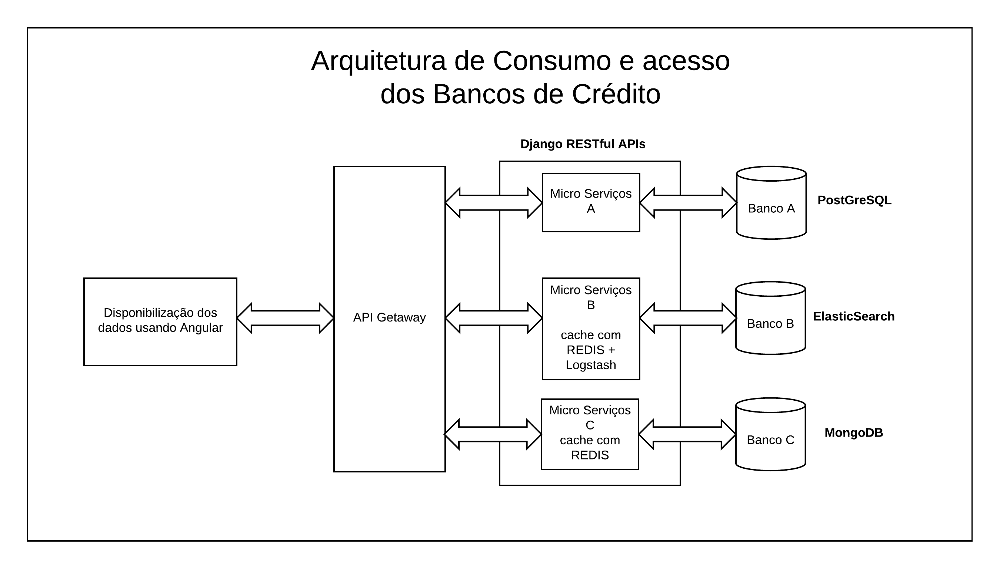

# Bureau-de-Credito (Em desenvolvimento)
Este projeto e proposta de arquitetura tem por objetivo propor uma solução viável para acesso e consumo de informação de 3 bancos de dados com níveis de segurança, criticidade e performance controlados na linguagem Python.

## O Problema:
*Banco A* tem informações críticas e sigilosas e precisa de acesso seguro as informações sem necessidade de velocidade.

*Banco B* tem informações críticas e sigilosas e precisa de acesso seguro as informações mas precisa ser rápido pois é consumido por Machine Learning.

*Banco C* não tem informações críticas e precisa de velocidade.
  
  ARQUITETURA PROPOSTA:
  
 
## Justificativa:
  A Arquitetura acima proposta tem um modelo baseado em Microserviços utilizando RESTful APIs em Django com JWT. Entre as camadas de apresentação e as APIS temos um API Getaway controlando as requisições, aumentando assim a segurança e evitando problemas com endpoints diretos. A camada de frontEnd de acessos aos dados usa Angular por motivos de ser bem consolidade e de grande rapidez na leitura e troca de informações com o BackEnd.

## Escolha dos Bancos de Dados:
  Para o Banco A, a arquitetura proposta indica a utilização de PostGreSQL. A escolha do PostGreSQL para a utilização com banco de dados foi por motivos de segurança, consolidação no mercado de bancos de dados relacionais, escalabilidade e ótima performance.
	Para o Banco B, o qual necessita de velocidade e segurança, foi proposta a utilização do ElastiSearch como banco de dados NoSQL pela sua forma de armazenamento distribuído e indexação que facilita a utilização por ferramentas de Machine Learning. No Microserviço que acessa esta estrutura usamos cacheamento via REDIS e Logstash(monitoramento) para consumo do cache em RAM.
	Para o Banco C for proposta a utilização do MongoDB pois tem rapidez, robustez e trabalha de forma distribuída, podendo dar velocidade aos acessos aos dados. No microserviço que acessa a estrutura do banco C usamos cacheamento usando apenas o REDIS, também para consumo em RAM.

Payloads ServiceDebits:
```
 payload = {
	'CPF': String,
 	'Name': String,
 	'Address': String,
 	'Debits':{
		['company': String,
		'value': Float,
		'created_at': DateTime
	}
}


Payloads ServiceAssets:
 payload = {
	'CPF': String,
 	'Age': Integer,
 	'Address': String,
	'Economic_Income': String
 	'Assets':[{
		'description': String,
		'value': Float,
	}]
}

Payloads ServiceTransactions (Em construção):
 payload = {
	'CPF': String,
 	'Last_Search': Datetime,
 	'Last_purchase': [{
		'company': String,
		'value': Float,
		'date': DateTime
	}],
 	'history_transactions':[{
		'type': String,
		'value': Float,
		'date': DateTime
	}]
}
```

## Django RestFul APIS:

As APIs foram desenvolvidas usando Python com Django Rest Framework (https://www.django-rest-framework.org) com autenticação JWT (https://jwt.io/).

## Pré-requisitos
- Docker >= 18.09.7
- Docker Compose >= 1.24.0

## Bootstrap do Projeto
Para a inicialização do projeto siga os seguintes STEPS:
- Navegue até a raiz do projeto (mesmo diretório que o docker-compose.yml)
- Execute os seguintes comandos:
```docker-compose up -d```
 rodar os migrations:
 ``` docker-compose run service_a python manage.py migrate ```
 ``` docker-compose run service_b python manage.py migrate ```
 criar o superusuário dos services:
 ``` docker-compose run service_a python manage.py createsuperuser ```
 ``` docker-compose run service_b python manage.py createsuperuser ```

Acessar os endpoints dos serviços:
- ### Serviço ServiceDebits: http://localhost:8000/
	- http://localhost:8000/persons/
	- http://localhost:8000/debits/
- ### Serviço ServiceDebits: http://localhost:7000/
	- http://localhost:7000/consumer/
	- http://localhost:7000/assets/

OBS: DETALHAMENTO DOS PAYLOADS podem ser acessados via endpoint no Browser.
